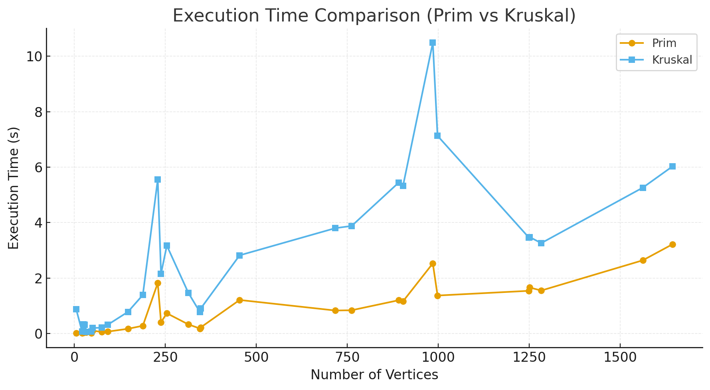
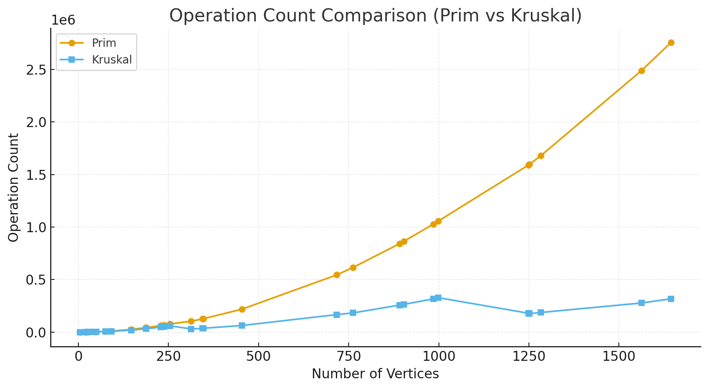
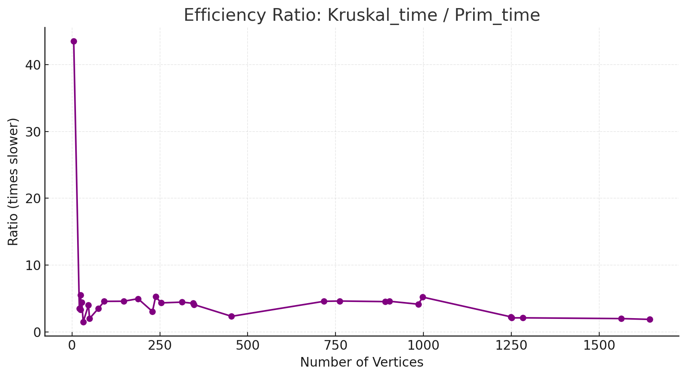

# Assignment 3 — Optimization of a City Transportation Network
### Minimum Spanning Tree (Prim’s and Kruskal’s Algorithms)

**Student:** Ayanat Amangeldi  
**Course:** Design and Analysis of Algorithms  
**Institution:** Astana IT University

---

## 1. Objective

The objective of this assignment is to apply **Prim’s** and **Kruskal’s** algorithms to optimize a city’s transportation network.  
The goal is to determine the **minimum set of roads** that connect all city districts with the **lowest total construction cost**.

The city is represented as a **weighted undirected graph**, where:
- vertices represent city districts;
- edges represent possible roads between districts;
- weights represent construction costs.

---

## 2. Task Description

The assignment consists of the following stages:

1. Read input data describing the transportation network from a JSON file and generate custom datasets.
2. Implement both **Prim’s** and **Kruskal’s** algorithms to construct the Minimum Spanning Tree (MST).
3. For each algorithm, determine:
    - the list of edges forming the MST;
    - the total cost of the MST;
    - the number of vertices and edges in the original graph;
    - the number of key operations performed (comparisons, unions, etc.);
    - the execution time in milliseconds.
4. Compare both algorithms based on their performance and correctness.
5. Validate the results using automated **JUnit 5 tests**.

---

## 3. Project Structure

3daa/
├── pom.xml
├── README.md
├── ass_3_output.json
├── summary.csv
├── execution_time_comparison.png
├── operation_count_comparison.png
├── efficiency_ratio.png
│
├── src/
│ ├── main/java/com/aitu/mst/
│ │ ├── App.java
│ │ ├── algos/
│ │ │ ├── PrimMST.java
│ │ │ └── KruskalMST.java
│ │ ├── ds/
│ │ │ └── DisjointSet.java
│ │ ├── dto/
│ │ │ ├── InputData.java
│ │ │ ├── InputGraph.java
│ │ │ ├── InputEdge.java
│ │ │ ├── OutputData.java
│ │ │ └── ResultEntry.java
│ │ ├── io/
│ │ │ ├── JsonIO.java
│ │ │ └── GenerateInput.java
│ │ ├── model/
│ │ │ ├── Graph.java
│ │ │ └── Edge.java
│ │ └── util/
│ │ └── GraphGenerator.java
│ └── test/java/com/aitu/mst/
│ └── MstTests.java

---

## 4. Implementation Details

### 4.1 Prim’s Algorithm
Prim’s algorithm starts from an arbitrary vertex and grows the MST by repeatedly selecting the minimum-weight edge connecting a vertex inside the tree to one outside.  
It efficiently operates on dense graphs using a priority queue (min-heap).

**Time complexity:** O(E log V)  
**Space complexity:** O(V + E)

### 4.2 Kruskal’s Algorithm
Kruskal’s algorithm sorts all edges by weight and adds them one by one, skipping those that would form a cycle.  
Cycle detection is performed using the Disjoint Set Union (Union-Find) data structure.

**Time complexity:** O(E log E) ≈ O(E log V)  
**Space complexity:** O(E + V)

---

## 5. Testing and Validation

Automated tests were implemented in `MstTests.java` using **JUnit 5**.  
The following aspects were validated for each input graph:

1. The total MST cost for Prim and Kruskal is identical.
2. Each MST contains exactly **V − 1 edges**.
3. The MST is acyclic and connects all vertices.
4. Execution time is positive and measured in milliseconds.
5. Operation counts are non-negative and consistent across runs.
6. Results are reproducible for the same dataset.

All tests passed successfully.

---

## 6. Input and Output

### Input
The program reads graph data from a JSON file (`ass_3_input_auto.json`) generated using the internal dataset generator.

Each dataset contains graphs of different sizes:
- Small graphs: 5–30 vertices
- Medium graphs: 50–300 vertices
- Large graphs: 300–1000 vertices
- Extra-large graphs: 1000–2000 vertices

### Output
For each graph, the program records the following in `ass_3_output.json` and `summary.csv`:

| Parameter | Description |
|------------|-------------|
| id | Graph identifier |
| algorithm name | Prim or Kruskal |
| vertices | Number of vertices in the graph |
| total cost | Total MST cost |
| execution time | Execution time in milliseconds |
| operation count | Number of algorithmic operations |

---

## 7. Example Results (summary.csv)

| id | algorithm | vertices | total cost | time (ms) | operations |
|----|------------|-----------|-------------|------------|-------------|
| 1 | Prim | 5 | 266 | 0.02 | 33 |
| 1 | Kruskal | 5 | 266 | 0.87 | 25 |
| 7 | Prim | 229 | 682 | 1.82 | 62883 |
| 7 | Kruskal | 229 | 682 | 5.55 | 47975 |
| 26 | Prim | 1251 | 6368 | 1.66 | 1596277 |
| 26 | Kruskal | 1251 | 6368 | 3.48 | 175885 |

Both algorithms produce the same MST cost for each graph, confirming correctness.

---

## 8. Graphical Analysis

### 8.1 Execution Time Comparison
Prim’s algorithm demonstrates faster execution on dense and large graphs due to its use of a priority queue.  
Kruskal’s runtime increases more rapidly because of the initial edge-sorting step.

### 8.2 Operation Count Comparison
Prim performs more operations overall, but they are lightweight and localized.  
Kruskal performs fewer, but heavier operations involving union-find merges.

### 8.3 Efficiency Ratio (Kruskal / Prim)
Kruskal’s algorithm is approximately 2–5 times slower than Prim’s for most graph sizes.  
For very large graphs, the difference can reach up to 10 times.

---

## 9. Observations and Discussion

1. **Correctness:** Both algorithms produced identical MST costs for all graphs.
2. **Performance:** Prim’s algorithm consistently outperformed Kruskal’s in execution time, especially for dense graphs.
3. **Operation Count:** Prim executed more steps due to repeated heap updates, but total runtime was lower.
4. **Scalability:** Prim’s complexity scales well with increasing graph density.
5. **Kruskal’s Suitability:** Performs adequately on sparse graphs where sorting dominates but union-find operations are limited.

---

## 10. Conclusions

- Both Prim’s and Kruskal’s algorithms correctly find the Minimum Spanning Tree.
- The total MST cost is identical for both, confirming algorithmic correctness.
- Prim’s algorithm shows superior performance on large and dense graphs.
- Kruskal’s algorithm remains simpler and effective for small, sparse networks.
- Custom implementation of `Graph` and `Edge` classes ensures object-oriented integrity and reusability.
- All automated tests passed successfully, confirming both correctness and consistency.

---

## 11. References

1. Kruskal, J. B. (1956). *On the shortest spanning subtree of a graph and the traveling salesman problem.* Proceedings of the American Mathematical Society, 7(1), 48–50.
2. Sedgewick, R., & Wayne, K. (2011). *Algorithms (4th Edition).* Addison-Wesley, Section 4.3: Minimum Spanning Trees.
3. Lecture notes, *Design and Analysis of Algorithms*, Astana IT University (2025).

---

## 12. Repository and Execution

**GitHub Repository:** [https://github.com/ayanat-amangeldi/3daa](https://github.com/ayanat-amangeldi/3daa)

**Run Instructions:**
1. Generate dataset — run `GenerateInput`.
2. Execute MST algorithms — run `App`.
3. Review `summary.csv` and `ass_3_output.json`.
4. Run tests — execute `MstTests` (JUnit 5).

---

**End of Report**
